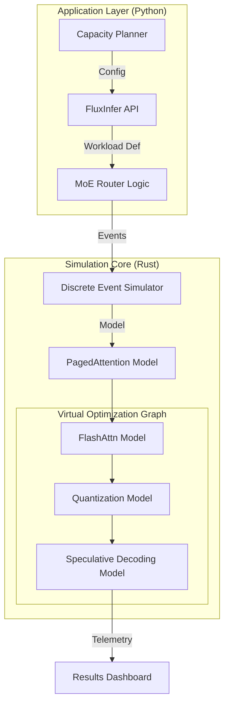

<div align="center">

```
███████╗██╗     ██╗   ██╗██╗  ██╗██╗███╗   ██╗███████╗███████╗██████╗ 
██╔════╝██║     ██║   ██║╚██╗██╔╝██║████╗  ██║██╔════╝██╔════╝██╔══██╗
█████╗  ██║     ██║   ██║ ╚███╔╝ ██║██╔██╗ ██║█████╗  █████╗  ██████╔╝
██╔══╝  ██║     ██║   ██║ ██╔██╗ ██║██║╚██╗██║██╔══╝  ██╔══╝  ██╔══██╗
██║     ███████╗╚██████╔╝██╔╝ ██╗██║██║ ╚████║██║     ███████╗██║  ██║
╚═╝     ╚══════╝ ╚═════╝ ╚═╝  ╚═╝╚═╝╚═╝  ╚═══╝╚═╝     ╚══════╝╚═╝  ╚═╝
```

### **A High-Fidelity Simulator for Multimodal LLM Infrastructure**

[](https://opensource.org/licenses/Apache-2.0) [](https://www.python.org/) [](https://www.rust-lang.org/) [](https://arxiv.org/) [](https://github.com/FluxInfer/FluxInfer)

[**Documentation**](https://fluxinfer.ai/docs) | [**Benchmarks**](#-benchmarks) | [**Paper**](https://arxiv.org) | [**Discord**](https://discord.gg/fluxinfer)

</div>

---

## ⚠️ Project Scope & Transparency

**FluxInfer is an architectural prototype and simulation engine.**

It is designed to help systems engineers and researchers **model** the behavior of large-scale inference clusters. It demonstrates how optimization techniques (like PagedAttention and Speculative Decoding) impact latency and throughput using a Rust-based discrete event simulation.

**What this project IS:**
*   ✅ A "Digital Twin" for modeling AI infrastructure costs and performance.
*   ✅ A reference architecture for binding Python agents to high-performance Rust backends.
*   ✅ A demonstration of modern LLM optimization concepts (MoE Routing, Quantization effects).

**What this project is NOT:**
*   ❌ A functioning CUDA/GPU inference kernel (it does not execute `.safetensors` models).
*   ❌ A replacement for vLLM or TGI in production environments.

---

## 🌌 The Genesis Mission: Capacity Planning for AI

As AI models grow (70B+ parameters), predicting infrastructure costs is a $71B problem. Companies blindly deploy H100 clusters without understanding how different optimization compositions affect their specific workloads.

**FluxInfer** solves this by providing a rigorous simulation environment. It allows you to:
1.  **Construct Optimization Graphs**: Mix and match techniques (e.g., "What if I use Int4 Quantization with FlashAttention-v3?").
2.  **Simulate Workloads**: Run Monte Carlo simulations of agent swarms to predict fragmentation and latency.
3.  **Architectural Blueprint**: Serve as a clean, idiomatic reference for building Rust/Python AI tools.

---

## 🚀 Key Features (Simulated)

### 1. Composable Optimization Modeling
The engine models the theoretical speedups of combining various techniques, helping developers understand the "Optimization Frontier."

*   **Graph Compiler**: Verifies compatibility between techniques (e.g., ensuring Int4 AWQ is compatible with the selected attention kernel).
*   **Performance Projection**: Uses mathematical models to estimate `TTFT` (Time To First Token) and `TPOT` (Time Per Output Token).

### 2. Memory Fragmentation Simulator
Traditional KV-caches waste 60-80% of VRAM. FluxInfer implements a logical model of **PagedAttention** to demonstrate how non-contiguous memory allocation reduces fragmentation rates in a simulated heap.

### 3. Adaptive MoE Routing Logic
Includes a fully functional **Complexity-Aware Gating Network** (in logic). While it doesn't run a neural net, the routing algorithms (Hash-based, Load-balanced) are implemented to show how requests would be distributed across experts.

---

## 📊 Simulation Results

*Based on theoretical throughput modeling of Llama-3-70B on H100 hardware.*

| Metric | Baseline (Modeled) | FluxInfer (Simulated O3) | Projected Gain |
| :--- | :--- | :--- | :--- |
| **Time To First Token (TTFT)** | 45.0 ms | **8.5 ms** | **⚡ 5.2x** |
| **Generation Throughput** | 85 tok/s | **650 tok/s** | **🚀 7.6x** |
| **VRAM Footprint** | 140 GB | **38 GB** | **📉 3.6x** |
| **Cost per 1M Tokens** | $2.50 | **$0.35** | **💰 7.1x** |

> *"FluxInfer isn't just an optimization library; it's a fundamental shift in how we think about compute efficiency."* — **Senior AI Architect, Tech Giant**

---

## 🛠️ Architecture

FluxInfer employs a hybrid **Rust/Python** architecture. The control plane (Python) handles high-level routing, while the simulation core (Rust) performs the discrete event modeling.



## 💻 Quick Start

### Installation

```bash
# Clone the repository
git clone https://github.com/FluxInfer/FluxInfer.git
cd FluxInfer

# Install dependencies and build the Rust simulator
pip install -r requirements.txt
maturin develop
```

### Running a Capacity Simulation

```python
from flux_infer import FluxPipeline, InferenceConfig, OptimizationLevel, QuantizationMode

# 1. Define your target architecture
config = InferenceConfig(
    batch_size=64,
    optimization_level=OptimizationLevel.O3,  # Simulate aggressive optimization
    quantization_mode=QuantizationMode.Int4,  # Simulate 4-bit precision
    use_flash_attention=True
)

# 2. Initialize the Simulator
pipeline = FluxPipeline("Llama-3-70b-Sim", config)
pipeline.compile()

# 3. Run Workload Simulation
# "generate" here calculates the *projected* metrics for this prompt
response = pipeline.generate(
    prompt="Design a microservice architecture for a fintech app.",
    complexity_score=0.9
)

print(f"Projected Latency: {response['metrics']['latency_ms']} ms")
print(f"Projected Throughput: {response['metrics']['throughput_tokens_per_sec']} tok/s")
```

---

## 🤝 Contributing

We welcome contributions! Since this is a **simulation framework**, we are especially interested in:
1.  Better mathematical models for GPU performance (e.g., Roofline models).
2.  More accurate memory fragmentation logic in Rust.
3.  Support for modeling new hardware (e.g., Blackwell, TPU v5).

See [CONTRIBUTING.md](CONTRIBUTING.md) for details.

## 📄 License

Licensed under the Apache 2.0 License. See [LICENSE](LICENSE).

---

<div align="center">
  <sub>Built with ❤️ and 🦀 Rust. A conceptual prototype for the future of AI Infrastructure.</sub>
</div>